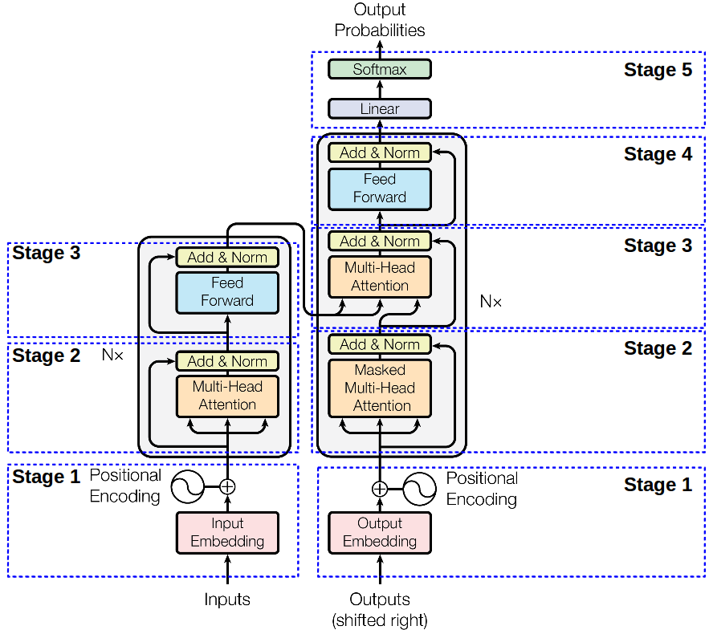
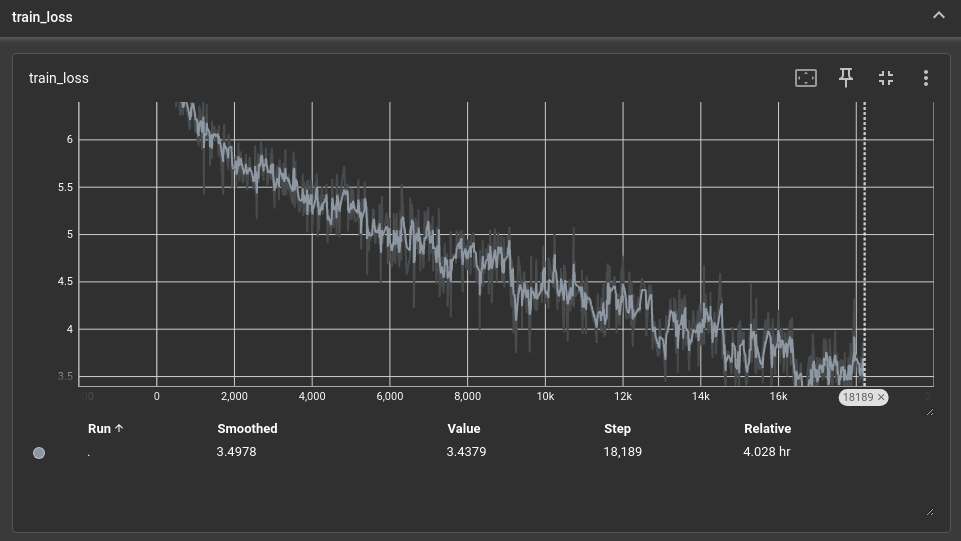
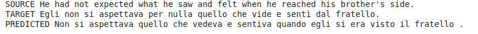

# Language translation using a transformer

This repository contains the Pytorch code to train a transformer (encoder-decoder) model for language translation.

## Dataset
The task is to convert English to Italian text. We use the [Opus books](https://huggingface.co/datasets/Helsinki-NLP/opus_books) dataset.

## Model 
### Architecture
The paper [Attention is all you need](https://arxiv.org/abs/1706.03762) introduced the transformer architecture.

The vanilla transformer (see fig) contains embedding layers (Stage 1),  encoder (Stage 2 & 3)  and decoder (Stage 2, 3 & 4) layers, and finally a linear layer.
The encoder and decoder have `Nx` layers of encoder blocks and decoder blocks respectively. These blocks contain the following components:

1. Attention
2. Feed forward
3. Layer Normalization

The model architecture is defined in [model.py](./src/model_pytorch.py). 
In [model.py](./src/model_pytorch.py), we use `build_tranformer` to create the transformer architecture.

#### Stage 1: Embedding layer
The `InputEmbedding` layer learns the word embeddings for a vocabulary of size `vocab_size`,; each embedding is `d_model` dimension.
In our code, we set `d_model` to 512. The [nn.Embedding](https://pytorch.org/docs/stable/generated/torch.nn.Embedding.html) is used to store word embedding.

Similarly, the Output Embedding layer is created to learn the output embeddings for the target language. We use the same class `InputEmbedding` to initialize the layer.

Next, a `PositionalEmbedding` layer is used to learn the positional encodings for the words. This is required as the position of words in a sentence 
makes a huge difference in its meaning. In order to retain this information while training the transformer, positional encoding is used. 
Using an index to encode the position is not a scalable solution as the input sequence length may be extremely large. Transformers, instead use
vectors to map to the position (or index) in the sequence. The authors of the paper proposed to map even indices to a sine function and odd indices to a cosine function.
In this case, we use fixed embeddings for position and they are not trained. 
Refer [this link](https://machinelearningmastery.com/a-gentle-introduction-to-positional-encoding-in-transformer-models-part-1/) for examples on how this is done.




#### Stages 2 & 3: Multi-Head Attention
**Self-attention** is the mechanism that a transformer uses to include contextual relevance between different input tokens (word embeddings or image patch embeddings). 
It works by comparing every word in the sequence to every other word in the sequence, including itself, and reweighing the embeddings of each token to include contextual relevance.
It takes in word embeddings without context and returns embeddings with contextual information.
* First, for each input token create q, k and v vectors by multiplying the token embedding with 3 weight matrices Wq, Wk and Wv.  The key roughly represents the features of the token ("how can we describe the element") 
and the value is a vector that represents the value given to the element. The weight matrices are trainable parameters.
* Next, calculate the scores of the input sequence against each token by taking a dot product of the query vector q with key vector of each key vector. 
This tells us how to weigh the other tokens when the current considered token is at a certain position.
* Divide by the dimension of key vectors to get stable gradients and then normalize the scores using softmax.
* Multiply each value vector by the softmax score to get its weighted values. Smaller weights show less importance of that input token at the current position.

```python
attention_scores = (queries @ keys.transpose(-2, -1)) / math.sqrt(d_k)
attention_scores = attention_scores.softmax(dim=-1)
value_score = attention_scores @ values
```

In a single head attention, the model learns one representation for the words in the sequence based on the queries, keys and values. However, we would want the model to learn
multiple representations. Analogous to using multiple kernels in CNNS to learn feature maps with multiple channels, transformers use **Multi-Head Attention** to 
potentially learn to attend to different parts of the input sequence.

The Encoder and Decoder layer uses self attention to learn about the current input sequence(shown as Multi-Head Attention in Encoder and Masked Multi-Head Attention in Decpder).
Since the Decoder needs to predict the next word based on only the context provided by the previous words in the sequence, the **Masked** Multi-Head Attention 
is used to mask out the attention scores of the future words. This is known as Causal Self-Attention.

In addition to learning about the current input sequence, the Decoder needs to learn the context from other input sequences in the dataset. This is done using cross attention, indicated as the second 
`Multi-Head Attention" block in the Decoder in figure. The block takes as input the encoder output (from left) and the sequence processed by the decoder (from below).

#### Stages 2 & 3: Add & Norm

This is a `ResidualConnection` followed by a `LayerNormalization` layer. 

#### Stages 3 & 4: Feed Forward 
Adding feed forward layers increases the capacity of the model amd also introduces non-linearity to learn complex relationships.

#### Stage 5: Projection layer
The `ProjectionLayer` has a linear layer and a Softmax layer to predict probabilities. 

#### Encoder and Decoder
The Encoder contains `Nx` blocks of a self attention and a feed forward layer. The Decoder contains `Nx` blocks of a cross attention, self attention and a feed forward layer.

The model summary is shown below:

```text
Transformer(
  (encoder): Encoder(
    (layers): ModuleList(
      (0-5): 6 x EncoderBlock(
        (self_attention_block): MultiHeadAttentionBlock(
          (w_q): Linear(in_features=512, out_features=512, bias=False)
          (w_k): Linear(in_features=512, out_features=512, bias=False)
          (w_v): Linear(in_features=512, out_features=512, bias=False)
          (w_out): Linear(in_features=512, out_features=512, bias=False)
          (dropout): Dropout(p=0.1, inplace=False)
        )
        (feed_forward_block): FeedForwardBlock(
          (linear1): Linear(in_features=512, out_features=2048, bias=True)
          (dropout): Dropout(p=0.1, inplace=False)
          (linear2): Linear(in_features=2048, out_features=512, bias=True)
        )
        (residual_connection): ModuleList(
          (0-1): 2 x ResidualConnection(
            (dropout): Dropout(p=0.1, inplace=False)
            (norm): LayerNormalization()
          )
        )
      )
    )
    (norm): LayerNormalization()
  )
  (decoder): Decoder(
    (layers): ModuleList(
      (0-5): 6 x DecoderBlock(
        (self_attention_block): MultiHeadAttentionBlock(
          (w_q): Linear(in_features=512, out_features=512, bias=False)
          (w_k): Linear(in_features=512, out_features=512, bias=False)
          (w_v): Linear(in_features=512, out_features=512, bias=False)
          (w_out): Linear(in_features=512, out_features=512, bias=False)
          (dropout): Dropout(p=0.1, inplace=False)
        )
        (cross_attention_block): MultiHeadAttentionBlock(
          (w_q): Linear(in_features=512, out_features=512, bias=False)
          (w_k): Linear(in_features=512, out_features=512, bias=False)
          (w_v): Linear(in_features=512, out_features=512, bias=False)
          (w_out): Linear(in_features=512, out_features=512, bias=False)
          (dropout): Dropout(p=0.1, inplace=False)
        )
        (feed_forward_block): FeedForwardBlock(
          (linear1): Linear(in_features=512, out_features=2048, bias=True)
          (dropout): Dropout(p=0.1, inplace=False)
          (linear2): Linear(in_features=2048, out_features=512, bias=True)
        )
        (residual_connection): ModuleList(
          (0-2): 3 x ResidualConnection(
            (dropout): Dropout(p=0.1, inplace=False)
            (norm): LayerNormalization()
          )
        )
      )
    )
    (norm): LayerNormalization()
  )
  (src_embed): InputEmbeddings(
    (embedding): Embedding(15698, 512)
  )
  (tgt_embed): InputEmbeddings(
    (embedding): Embedding(22463, 512)
  )
  (src_pos): PositionalEmbedding(
    (dropout): Dropout(p=0.1, inplace=False)
  )
  (tgt_pos): PositionalEmbedding(
    (dropout): Dropout(p=0.1, inplace=False)
  )
  (projection_layer): ProjectionLayer(
    (proj): Linear(in_features=512, out_features=22463, bias=True)
  )
)
```

## Training a model
The [notebook](./src/Language_Translation%20.ipynb) contains the steps to train the model.
The `config_file.py` contains the hyperparameters used in training.

### Loss function
The loss function is CrossEntropyLoss and the training loss curve is shown below.




## Evaluating the model 
We use **Greedy Decode** algorithm for inference. This algorithm chooses the prediction with highest probability.

### Results


## References
1. https://magazine.sebastianraschka.com/p/understanding-and-coding-self-attention